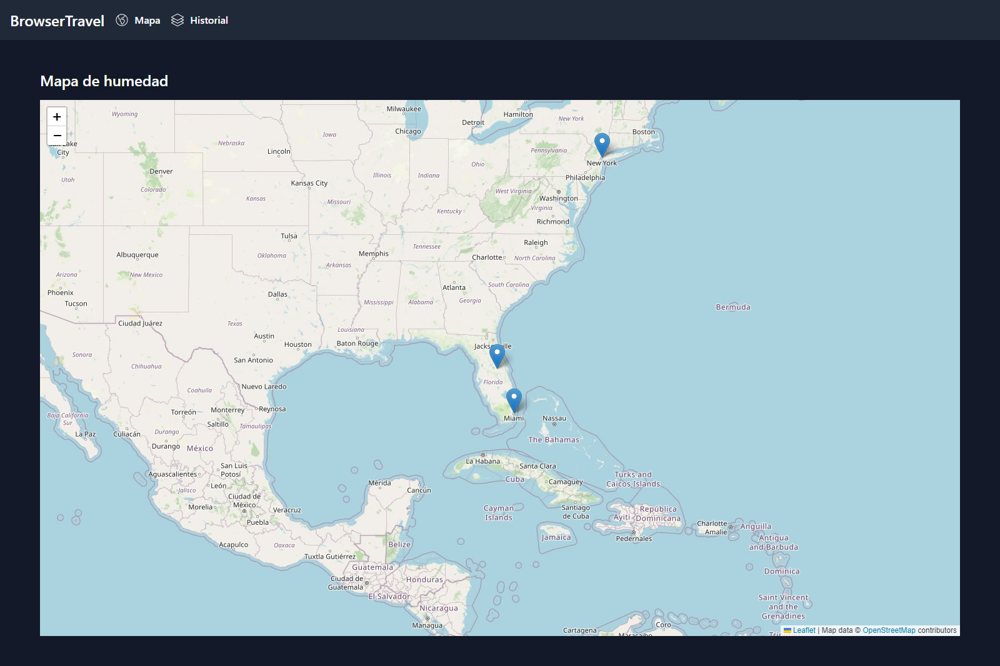
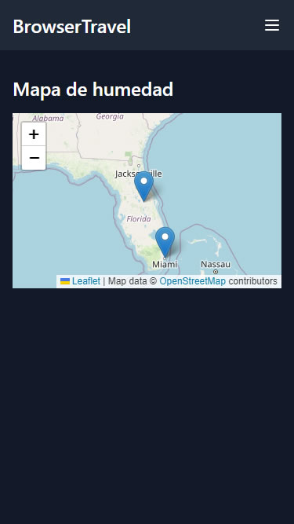
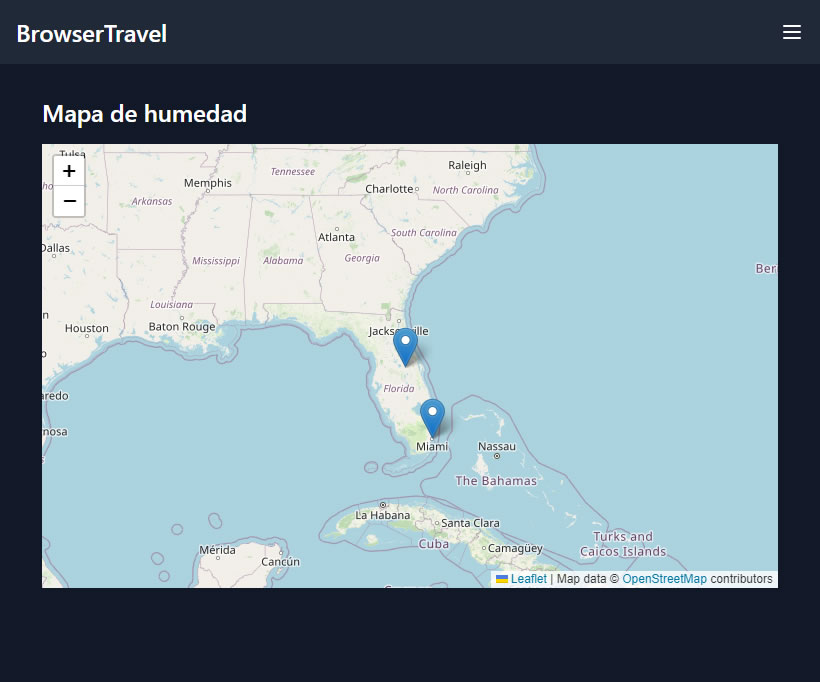
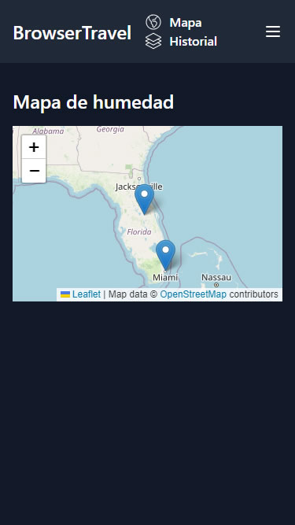
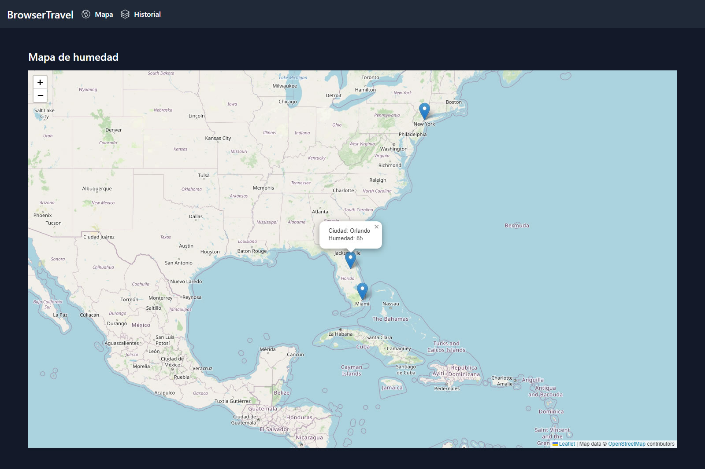
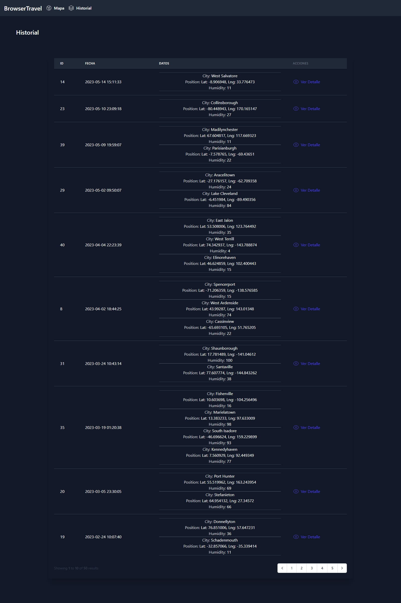
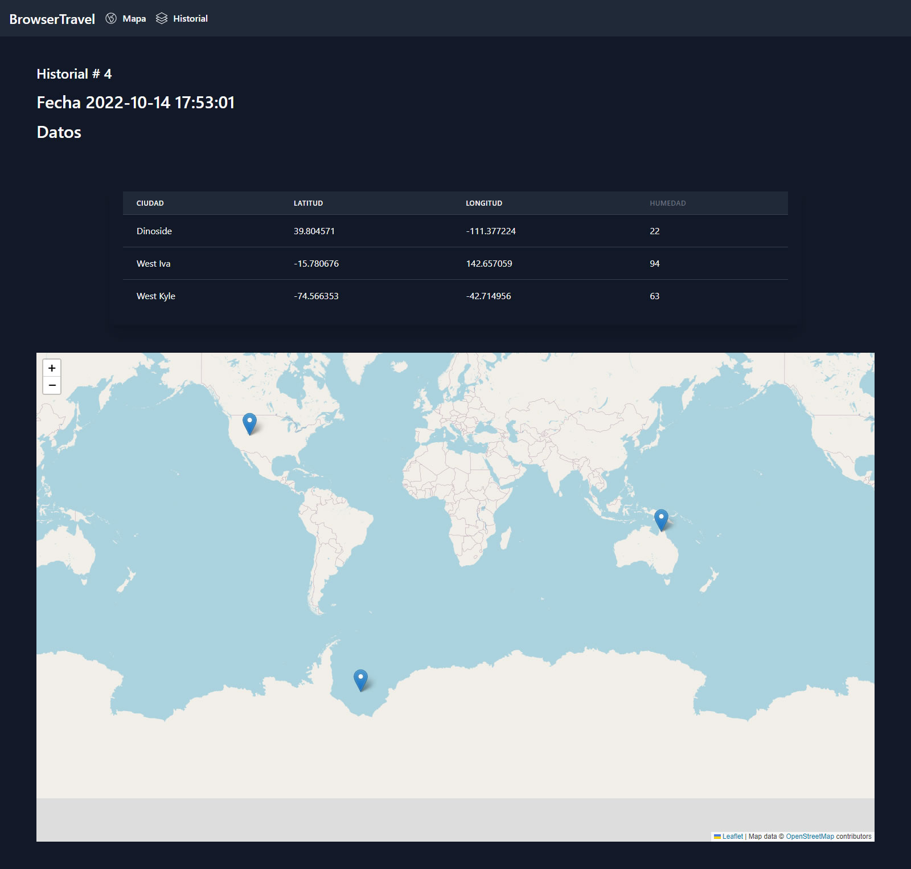

# :mount_fuji: Reto Técnico Browser Travel Solutions.

<br/>
<br/>

## :bookmark_tabs: Tabla de contenido.

<br/>
<br/>

1. [Autor.](#black_nib-autor)

<br/>
<br/>

2. [Detalle de la solución.](#triangular_ruler-detalle-de-la-solución)

<br/>
<br/>

3. [Desplegar.](#airplane-desplegar)

<br/>
<br/>

## :black_nib: Autor.

<br/>
<br/>

**John Fredy Velasco Bareño** [jovel882@gmail.com](mailto:jovel882@gmail.com)

## :triangular_ruler: Detalle de la solución.

<br/>
<br/>

- Está desarrollado con:

    <br/>
    <br/>

    - PHP 8.1

        <br/>
        <br/>

    - Laravel 10.8

        <br/>
        <br/>

    Se desarrolló basado en los requerimientos descritos y se consiguió lo siguiente:

    <br/>
    <br/>

    + Se crearon los siguientes modelos con sus respectivos seeders y factories:

        <br/>
        <br/>

        + `City`: Almacena las ciudades georreferenciadas de las cuales se buscará la humedad desde la API [https://openweathermap.org/api/one-call-api](https://openweathermap.org/api/one-call-api)

        <br/>
        <br/>

        + `History`: Almacena el historial de las búsquedas de la humedad de ciudades.

        <br/>
        <br/>

    + Se precargó la base de datos a través del seeder general con:

        <br/>
        <br/>

        + Los registros para las tres ciudades Miami, Orlando y Nueva York georreferenciadas con seeder.

        <br/>
        <br/>

        + 50 registros aleatorios generados con el factory para pruebas que incluyen de 1 a 4 ciudades.

        <br/>
        <br/>

    + Se realizaron los siguientes desarrollos:

        <br/>
        <br/>

        

        <br/>
        <br/>

        > En el menú superior se tienen dos opciones para ver el mapa en vivo o el historial de consulta.

        <br/>
        <br/>

        

        <br/>
        <br/>

        > Vista responsiva para móviles.

        <br/>
        <br/>

        

        <br/>
        <br/>

        > Vista responsiva para tablets.

        <br/>
        <br/>

        

        <br/>
        <br/>

        > Vista menú responsiva.

        <br/>
        <br/>

        + Todas las interfaces se desarrollaron usando Blade y Tailwind CSS para el manejo del responsive, incluyendo una plantilla base extensible.

        <br/>
        <br/>

        + Mapa con datos de humedad desde la API.

            <br/>
            <br/>

            

            <br/>
            <br/>

            > Esta es la interfaz del mapa con la marca de Orlando y el dato que está obtenido desde la API.

            <br/>
            <br/>

            + Se almacena en la base de datos en el historial cada consulta con la fecha y datos obtenidos.

                <br/>
                <br/>

                + Cuenta con validación a través de form request.

            <br/>
            <br/>

        + Histórico de consultas.

            <br/>
            <br/>

            

            <br/>
            <br/>

            > Esta es la interfaz con la lista del historial.

            <br/>
            <br/>

            + Al modelo se le generó un `Mutator` y un `Accessor` para trabajar con el JSON de los datos.

            <br/>
            <br/>

            + Tabla con los registros de cada una de las consultas y los datos obtenidos.

                <br/>
                <br/>

                + Cuenta con paginación.

                <br/>
                <br/>

            + Vista con el detalle de cada una de las consultas.

                <br/>
                <br/>

                

                <br/>
                <br/>

                > Detalle con los datos obtenidos y el mapa de los mismos.
        
<br/>
<br/>

## :airplane: Desplegar.

<br/>
<br/>

El proyecto cuenta con una opción de despliegue contenerizada con Docker, para usarla siga los siguientes pasos.

<br/>
<br/>

+ Prerrequisitos

    <br/>
    <br/>

    + **Docker >= 20.\***

    <br/>
    <br/>

    + **Docker Compose >=2.\***

    <br/>
    <br/>

    + **Git >=2.\***

    <br/>
    <br/>

+ Pasos

    <br/>
    <br/>

    > :bulb: Si está sobre algún sistema basado en Linux y ejecuta la siguiente línea, se iniciará un ambiente totalmente funcional sobre el DNS [browsertravel.test](http://browsertravel.test/).<br/><br/>
	Antes de ejecutar el comando recuerde cambiar el valor de `API_KEY_WEATHER` por la API Key de la plataforma [https://openweathermap.org/current](https://openweathermap.org/current).

    <br/>
    <br/>

    ```sh
    git clone https://github.com/jovel882/browsertravel.git && cd browsertravel && cp Docker/.env.example Docker/.env && sed -i -r 's/^(API_KEY_WEATHER_ORI=).*/\1"API_KEY_WEATHER"/' "Docker/.env" && docker compose -f Docker/docker-compose.yml up -d && docker logs -f browsertravel
    ```

    <br/>
    <br/>

    <br/>
    <br/>

    + Clone el repositorio

        <br/>
        <br/>

        ```sh
        git clone https://github.com/jovel882/browsertravel.git
        ```

        <br/>
        <br/>

    + Ingrese al folder del proyecto.

        <br/>
        <br/>

        ```sh
        cd browsertravel
        ```

        <br/>
        <br/>
            
    + Cree los archivos de entorno basados en los de ejemplo.

        <br/>
        <br/>

        + Genere el ***.env*** dentro del folder de **Docker**, estas son las variables disponibles.

            <br/>
            <br/>

            ```sh
            cp Docker/.env.example Docker/.env
            ```

            <br/>
            <br/>
            
            + `COMPOSE_PROJECT_NAME` (\*Requerido): Define el nombre del proyecto que se genera con Docker Compose, en el ejemplo se deja **browsertravel**.

            <br/>
            <br/>
            
            + `MYSQL_DATABASE` (\*Requerido): Define el nombre de la base de datos que se creará.

            <br/>
            <br/>
            
            + `MYSQL_ROOT_PASSWORD` (\*Requerido): Define la contraseña del usuario root del motor de base de datos. **NOTA: No dejar vacío**.

            <br/>
            <br/>
            
            + `API_KEY_WEATHER_ORI` (\*Requerido): Define el valor de la API KEY de la plataforma [https://openweathermap.org/current](https://openweathermap.org/current) para consultar los datos de humedad.

            <br/>
            <br/>

    + Variables dentro del archivo **"docker-compose.yml"**.

        <br/>
        <br/>

        + Dentro del servicio de nombre **"browsertravel"** en la sección de **"environment"**

            <br/>
            <br/>

            + `VIRTUAL_HOST` (\*Requerido): Define el nombre del DNS sobre el que se levantará el ambiente, por defecto se utiliza **browsertravel.test**.
                
            <br/>
            <br/>

    + Ejecute el archivo docker-compose.yml para levantar el ambiente.
    
        <br/>
        <br/>

        ```sh
        docker compose -f Docker/docker-compose.yml up -d
        ```

        <br/>
        <br/>

    + Siga el estado del despliegue del contenedor principal con el siguiente comando.

        <br/>
        <br/>

        ```sh
        docker logs -f browsertravel
        ```

        <br/>
        <br/>

        > :pushpin: En este log, si todo está correcto, podrá ver la instalación de paquetes con Composer, instalación de paquetes con NPM, compilado de archivos con NPM, ejecución de migraciones, ejecución de seeders y finalmente el inicio de los servicios del servidor web con Supervisor, entre otros.

        <br/>
        <br/>

    + Agregue el registro del host para redirigir las peticiones al **DNS** que se definió en **VIRTUAL_HOST** del archivo **"docker-compose.yml"**. En este [enlace](https://www.siteground.es/kb/archivo-hosts/) hay una forma de hacerlo dependiendo de su sistema operativo.

        <br/>
        <br/>
        
        **Ejemplo:**    

        <br/>
        <br/>

        ```sh
        127.0.0.1 browsertravel.test
        ```

    <br/>
    <br/>

    + Acceda al resultado de la solución **http://{DNS}**, donde **DNS** debe ser reemplazado por el que se definió en **VIRTUAL_HOST** del archivo **"docker-compose.yml"**. Ej. [http://browsertravel.test](http://browsertravel.test)

    <br/>
    <br/>

